Today we are going to take a look on AOC 2019 solutions using Dart. We will try to focus on it through a different side, trying to figure it out how to solve the problems with Dart functional side.

> Dart is a client-optimized language for fast apps on any platform.

[Dart](https://dart.dev) is an amazing language, which I'm having so much fun coding with it. The syntax is pretty straight forward if you know Kotlin, Swift or JavaScript (it's kinda of a mix-up). We have all the desirable features of a modern language: OOP, async/await built-in support, functional collection APIs (`map`, `where`, `reduce`, `fold`, etc.), spread operator, static typing (but with a powerful type inference) and a lot more. Important to notice that this article is being written as of `Dart 2.7`, so we already have the brand new `Extensions` functionality, which we might explore in another post.

## Advent of Code 2019 🎅

We will get to learn about Dart going through my solutions for the AOC 2019. Advent of Code runs through the days 01-25 of December (Advent time for christians), with two different problems each day. The second is normally built up on top of the first problem, and it is only made available for the "contestants" after solving the first one. You can find out more about AOC [on their official website](https://adventofcode.com/2019/about).

> Advent of Code is an Advent calendar of small programming puzzles for a variety of skill sets and skill levels that can be solved in any programming language you like. People use them as a speed contest, interview prep, company training, university coursework, practice problems, or to challenge each other.

I really encourage you to take on it next year, or solve the past ones as they continue available. I think it is a great opportunity to learn a new programming language, or if you are a really tryhard competitor, you can try to go for the leaderboar with your mastered language.

## How will it work 🔃

We will go through the day, but not all of them, as some of them are not that interesting for our point of view, but we will at least explain how it was meant to be done, just in case you are here looking for the solutions. We will be relying on the code available at my [Advent Of Dart repository](https://github.com/rafaeelaudibert/AdventOfCode.dart).

---

### Day One 🚀

We will from the beggining. Day one, [**The Tyranny of the Rocket Equation**](https://adventofcode.com/2019/day/1).

On **part one**, we have as our input a list of rocket module masses, and we need to compute the quantity of fuel needed to lift each rocket module using the formula `fuelRequired = floor(mass / 3) - 2`. We will assume that we have our problem input, the module masses, on an `List<int>`.

> `List<T>` is a generic data structure available natively at Dart, for any type `T`. Throghout this article we will use the Dart syntax `DataStructure<T>` which means a `DataStructure` which holds elements of type `T`. So, for instance, `List<int>` is a list with elements of type `int`. Moving on.

This program can be solved with the following one-liner:

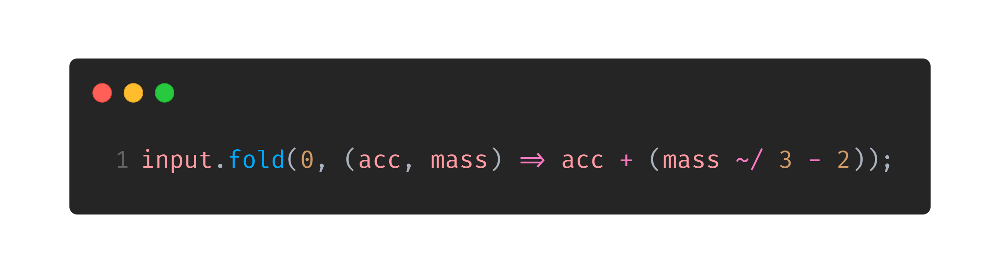

The `fold` function has the following signature: `T fold<T>(T initialValue, T Function(T previousValue, E element) combine)`. For those who know how `reduce` works, it is similar, but we need to pass an obligatory `initialValue`. It works combining the list on which it is iterating, accumulating the value for the next iteration. This is:

- It starts with the value `initialValue` and calls the `combine` function passing `initialValue` and the first value of the `Iterable` (the thing we are iterating).
- The value returned by the first iteration is then passed for the next iteration, together with the second `Iterable` value.
- And so on...

Something really nice on Dart is the `Iterable<T>` interface, which is something that we can iterate over. The great power on it comes from the fact that you doesn't need to store the entire data inside of it in memory, if you can compute it on the go. We will see more about it on the rest of the article. You can learn more about it on [Dart official Iterable documentation](https://api.dart.dev/stable/2.7.0/dart-core/Iterable-class.html).

Pretty nice, uh? That is the functional power. We just iterate over our list, passing the accumulated value ahead until we have applied the formula for all the elements. Also interesting to notice is the `~/` operator, that is the integer division operator in Dart.

> Why didn't you use `reduce`?

Because in Dart `Iterable.reduce<T>` only receives a `combine` function as parameter, and assumes that the initial value is the first value of the array. But we don't want that, because we need to apply the formula to it. So, we use `fold` to start with a sum neutral value: 0.

For **part two**, we need to build up on top of Part 1 problem. Every fuel we add to the rocket, is also counting as mass. So we need to compute the required fuel to be able to lift up the rocket with the already added fuel. We also need to take this fuel in consideration, and so on. The [recursion](https://en.wikipedia.org/wiki/Recursion_(computer_science)) ends when we would need less than 0 fuel, and we say that _"it is handled by wishing really hard"_ according to AOC. A recursive implementation can be seen below, also using `fold`.

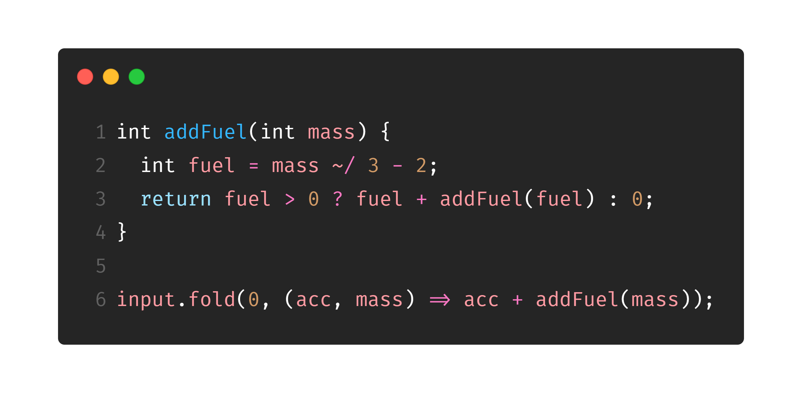

### Day Two 🖥️

Day 2 refers to the first problem using the **IntCode** interpreter. We won't talk about IntCode programs on this article, as I coded them on a pretty object-oriented manner. **Every odd day after day 4 is an IntCode program**, so they won't be listed. Maybe we can talk about the features used on it (_Enum_, _Queue_, _Map_, _Extensions_) on a future article.

### Day Three ❌

Day 3, [**Crossed Wires**](https://adventofcode.com/2019/day/3), offers a pretty basic introduction to `Iterable.map<T>`, and an overview on `Iterable.reduce<T>` which is pretty similar to `fold` as stated before.

For **part one**, given 2 lists of points, we need to find the closest point to the origin $$(0, 0)$$ (using [Manhattan Distance](https://en.wikipedia.org/wiki/Taxicab_geometry)) which belongs to both the lists. We will assume that the list of points are represented by a Dart `Set<Point<int>>`, which is an ordered data structure that holds **unique** elements on it. When refering to a `Point<int>`, unique means same $$x$$ and same $$y$$ values.

Basically, we create a `Set<Point<int>>` with the intersection between the points, and we "map" over them computing the distance to the origin. By "map", on Dart, we are refering to the `Iterable.map<T>(T Function(E element) f)` function. When called on an `Iterable` it calls the function `f` for each `element` of the current Iterable, producing a new element for each of them.

After this, we only need to take the minimum value on this list of `int`. On Dart, the `min` function doesn't work with an `Iterable` (like Python would), but only with two parameters `a` and `b`, returning the minimum of them. So we can use the `Iterable.reduce<T>` function, which works similary to the `fold` one, which was explained before, with the difference that its `initialValue` is always the first element of the `Iterable`.

Earlier, we created an anonymous function inside the `fold` function parameters. Now, we have something better. `reduce` will be waiting for a function which receives two integers and return an integer (so we can compute our minimum value). Instead of creating an anonymous function such as `(acc, val) => min(acc, val)`, we can pass the raw `min` function, as it already receives two parameters and return the minimum of them. So our one-liner (assuming we already have the points) is the following:

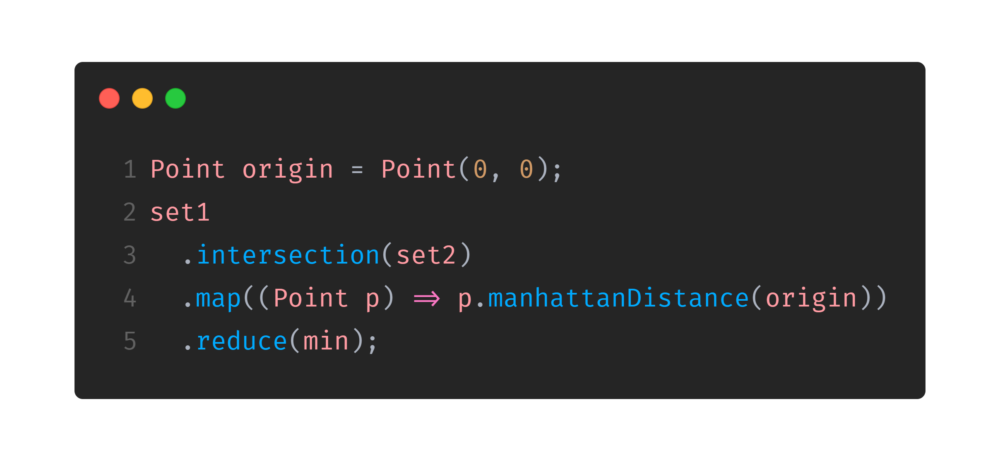

### Day Four 📦

**[Secure Container](https://adventofcode.com/2019/day/4)** wasn't much of a functional algorithm. The algorithm I coded is a simple iterative function that goes through the string trying to find the valid strings naively.

### Day Six 🪐

> Remember Day Five is skipped as every odd number after it (and including it) refer to IntCode programs

On Day 6, **[Universal Orbit Map](https://adventofcode.com/2019/day/6)**, for **part one**, given a [DAG](https://en.wikipedia.org/wiki/Directed_acyclic_graph), we need to sum all the distances from every node to the root of it.

We will assume our DAG is represented by a Dart `Map<String, List<String>> graph` which is basically an adjacency list, where every node is represented by a `String`. When we acess `graph[node]` (being node a `String`) we access all the nodes which point to our node. This is, if we had a DAG such as $$D \rightarrow A \leftarrow B \leftarrow C$$, we would have:

- `graph['A']`: `['B', 'D']`;
- `graph['B']`: `['C']`;
- `graph['C']`: `[]`, and,
- `graph['D']`: `[]`.

So, we only need to make a graph walking from the root to the leaves, summing every depth for every level. This can be made with a recursive function which receives the `node` we are visiting now, and the current `depth`. Every time we go through the list of neighbours, this is, the nodes which point to the current node we make a `fold` through all the neighbours, summing their depth which is returned recursively. You can see the one-liner (assuming we have the graph on a global `graph` variable) on the following image. To start computing it, we just need to call `exploreGraph(root, 0);`.

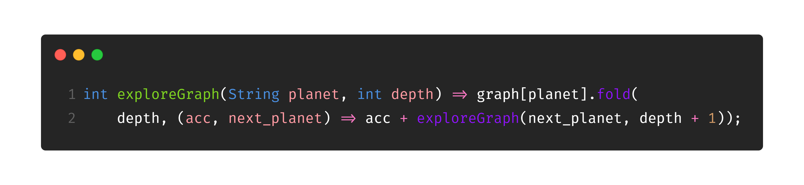

For **part two**, we have a simple BFS, which can be seen on the [repository](https://github.com/rafaeelaudibert/AdventOfCode.dart).

### Day Eight 🤳

On Day Eight, **[Space Image Format](https://adventofcode.com/2019/day/8)**, **part one**, we are asked to multiply the number of `1`'s and `2`'s on an string (after we find the string). If you are curious to see how we did find this string (the one with most zeros in the middle of a lot of strings) you can look at the [repository](https://github.com/rafaeelaudibert/AdventOfCode.dart), as, now, we are more interested on counting the numbers and multiplying them.

This is actually pretty easy, assuming we already have the string. We can `split` it to have a `List<String>` where every string is actually a character of the original string with `originalString.split('')`. After this, we can find the number of `1`'s and `2`'s in the same way using the commonly called `filter` function which is called `where` in Dart. Check it below:

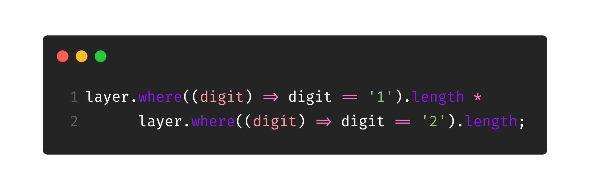

On dart we also have the `collection-for` syntax, which is clearly non functional, but it is interesting to check it out, as it is pretty similar to Python list comprehension:

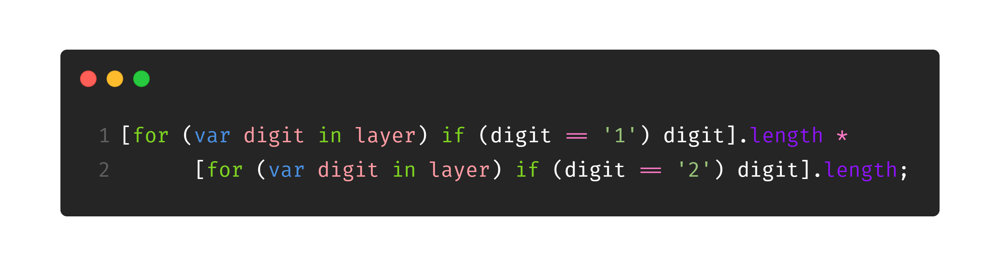

**Part two** has a kinda different focus than part one, and I didn't used anything worth of note (again, if you are here to find the answers, check the repository linked above). Let's move on!

### Day Ten ☄️

Day 10, [**Monitoring Station**](https://adventofcode.com/2019/day/10), won't add anything new to the functional bucket.

For **part one** and **two**, we need a function which computes, for a given asteroid, all the angles to the other asteroids, and we get how many uniques values we have on it. On my test cases we didn't have to worry about double precision because the spatial map was really small, but it is worth notice that if this was asked in a Programming Contest, we would probably have problems with double precision related to really close angles.

Just to help you further, we can calculate the angle between two points $$A$$ and $$B$$ using the arctangent trigonometric function which is named `atan2` in Dart. The formula would be as follow: `atan2(A.y - B.y, A.x - B.x)`. We use the $$y$$ difference in the first parameter and $$x$$ on the second to get the values in the interval $$[-\pi, \pi]$$, which will make it easier on **part 2**.

## Day Twelve ☀️

On day 12, [**The N-Body Problem**](https://adventofcode.com/2019/day/12), we are introduced to the `forEach` method. It is basically a replacemente for a `for (var x in y) { doSomething(x); doOtherThing(x); }`. With a `forEach` we would write `y.forEach((x) { doSomething(x); doOtherThing(x); }`. It is actually [non-idiomatic](https://dart.dev/guides/language/effective-dart) to use a `forEach` in this case, but my functional curious heart like using it, sorry.

**Part two** also brings some interesting math theory to the board. On this day we are basically making a really rough gravitational simulation, and we are asked when will all the planets return to their start position for the first time. We can't simulate it, because, for my input, it occurs after $$572087463375796$$ steps, which would take **LITERALLY ALMOST 4 YEARS** on my computer (it takes 2,1s for 10 million iterations). To make it faster we only need to see how many iterations it take to repeat on the $$x$$-axis, $$y$$-axis and $$z$$-axis and compute their LCM. This way we only iterate something like 200k iterations until they repeat on each of the axis. Below we have the `LCM` function implementation in Dart:

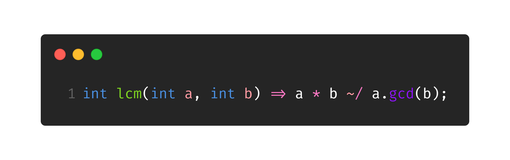

### Day Fourteen 🔭

Day 14, [**Space Stoichiometry**](https://adventofcode.com/2019/day/14), wasn't actually pretty easy for me, so I kinda copied **part one**, sorry (acknowledgments on the code).

**Part two** is actually interesting, where we just need to use a binary search on the part one answer (kinda known to those who like competitive programming). As a tip, when you have binary search on the answers you may have problems with your final result being one less or one more the real result, so always compute the neighbours of your "binary search answer" to find the real answer.

### Day Sixteen 📻

[**Flawed Frequency Transmission**](https://adventofcode.com/2019/day/16) doesn't have a lot of functional programming as well but there is a really nice curiosity about Dart (which I'm not exact sure why it happens, comment it below if you know it for sure). On part one, we need to compute a value based iteratively. This is, we have a value $$x_n$$ on time $$n$$ and based on it we compute the value $$x_{n+1}$$ for the time $$n + 1$$. To do so, we will iterate over each digit of the number $$x_n$$.

The full code can be seen on the [repository](https://github.com/rafaeelaudibert/AdventOfCode.dart), but we will focus on this little snippet:

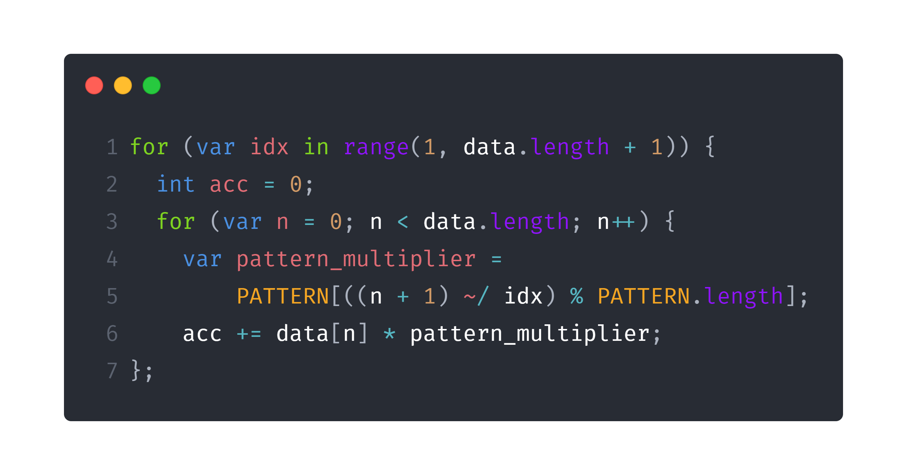

If we run  **part one** code with this code, it takes around `500ms` to give us the answer.

The interesting part comes now. I created a small helper `Iterable<int> range(int initialValue, int endValue)` which works similar to Python `range` function, so that I could substitute a `for (var i = 0; i < n; i++)` with a `for (var i in range(0, n))`. If I do so, we have this snippet:

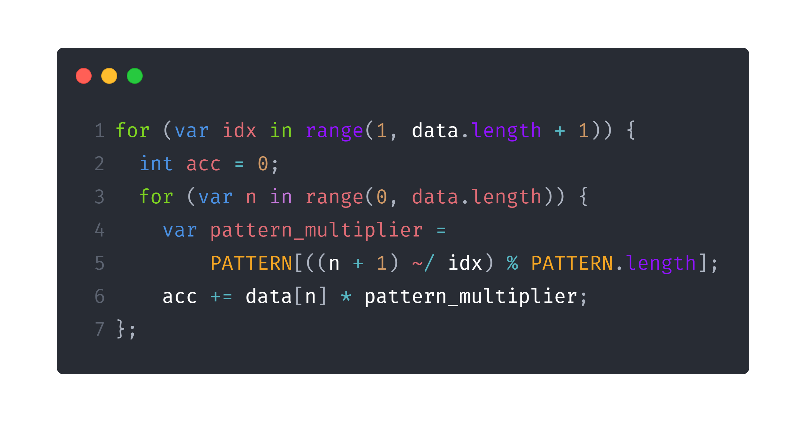

Guess the execution time now? `1100ms`! It more than doubled! Why? I really don't know how the Dart VM is implemented, but I assume it has to be with loop unrolling and data independency. You can note that one iteration of my loop doesn't depend on the other iteration of it, as I'm just accumulating the values in a variable, and the computed values doesn't need the values computed in the other iteration. So, the Dart VM can make use of parallelism or AVX-like instructions to compute more than one loop iteration at the same time. It also can easily predict what will be the next $$n$$ value, so it can easily add it to the chosen way of parallelism.

Why doesn't this happen with the `range`-based loop? Because the Dart VM can't do loop unrolling or know which will be the next $$n$$ until my `range` function produces the value.

What if we try to do it the functional way, iterating over the data list? To do so we would need the indices as well, which we can get transforming the `List<int>` into a `Map<int, int>` and apply a `fold` function on it, which can be seen here:

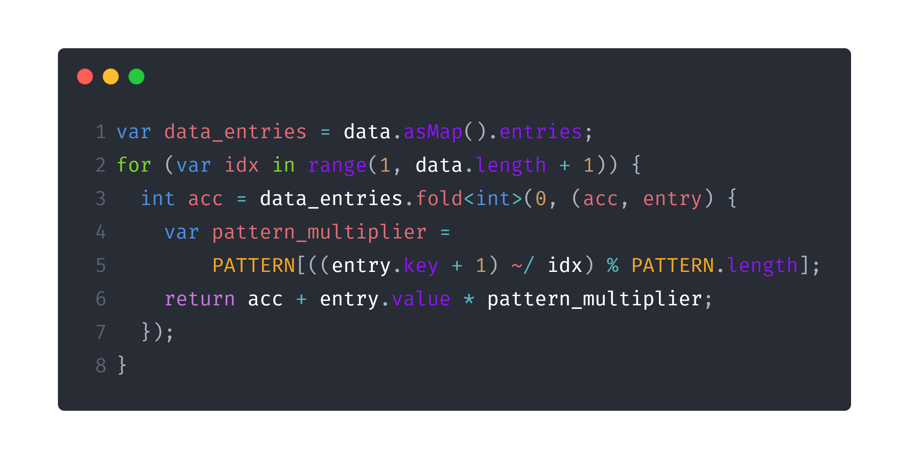

And it takes **2 SECONDS**? That's a huge performance loss. I thought the problem might be the conversion from `List` to `Map` but the list is only $$650$$ elements in size and even if I compute the map only once (before the loop) we don't see any time improvements. I really don't know what could be the reason, but maybe, just maybe, it is the same thing, and a lot of VM optimizations can't be applied when we are mapping over it this way.

On **part 2**, we needed to do the same thing but with **10 THOUSAND TIMES MORE DIGITS**. This was a really huge problem, but people figured it out how to do it. Based on some matrix multiplication properties and the problem properties, people discovered we could use just partial sums. The interesting  part on it, is how we generate the list with that much times more (we don't really need to generate $$10000$$ more (again, because of some properties) but we will assume we need for the snippet below) digits. In python we would have something like `list * 10000`, but we are not on this high level yet. We can make it like so on Dart:

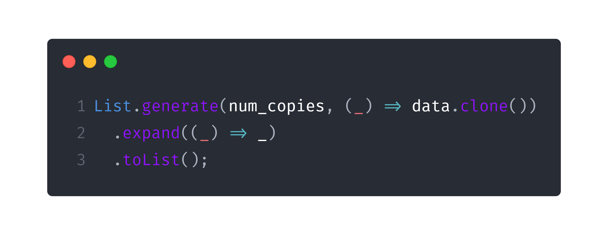

The named constructor `List.generate` receives the number of elements we want to generate on the `List` and we pass a function that receives the index, and generate an element for that position. After this step we would have a `List<List<int>>` but we need just a `List<int>` so we can use the `Iterable.expand<T>` function, to expand a `List<List<E>>` in a `List<T>` using a function which maps over the values, which, in our case, is just the indentity function (`(_) => _`).

### Day Eighteen 🗝️

Holy buckets [**Many-worlds Interpretation**](https://adventofcode.com/2019/day/18), this was so damn hard. I really don't have anything to say about it. Next.

### Day Twenty 🍩

Day 20, [**Donut Maze**](https://adventofcode.com/2019/day/20), is a trivial use of [Dijkstra's algorithm](https://en.wikipedia.org/wiki/Dijkstra%27s_algorithm) with some real problems to parse the input (where the portals are) and some small problems to build the graph. For **part two** we have some small complications because we need to know if the portals are "inside" or "outside", which is kinda hard-coded for me. Nothing functional worthy.

### Day Twenty-Two 🃏

Day 22, [**Slam Suffle**](https://adventofcode.com/2019/day/22), is actually really fun to do, and we can use some of functional programming on **part one**. On this problem, we have a deck of $$n$$ cards (which is represented by a `List<int>`), and we have three different shuffles we can apply on it.

- **Cut**: We take the $$k$$ first cards and put them below the $$n - k$$ others. This can be executed with `skip(int k)` and `take(int k)` functions. The `skip` one returns an `Iterable<T>` **WITHOUT** the first $$k$$ values, while the `take` function returns an `Iterable<T>` **WITH ONLY** the first $$k$$ values. So, to cut $$k$$ cards we only need a `deck = deck.skip(k).toList() + deck.take(k).toList();`.

- **Deal**: We reverse the cards. To do so, a simple `deck = deck.reversed.toList()` makes the job. Note that `Iterable<T> reversed` returns an `Iterable` so we need to make it into a list.

- **Deal with Increment**: This one is not that easy to make with functional programming, so I made it an interative fashion. Assuming we are using an increment $$k$$ we need to place the first card on position $$0$$, the next one on $$0 + k$$, the next on $$0 + 2 * k$$, and so on. Obviously, we would need to place cards on positions which doesn't belong to deck, so this formula is [modded](https://en.wikipedia.org/wiki/Modular_arithmetic) `deck.length`.

You can see the code for shuffling the deck on this snippet:

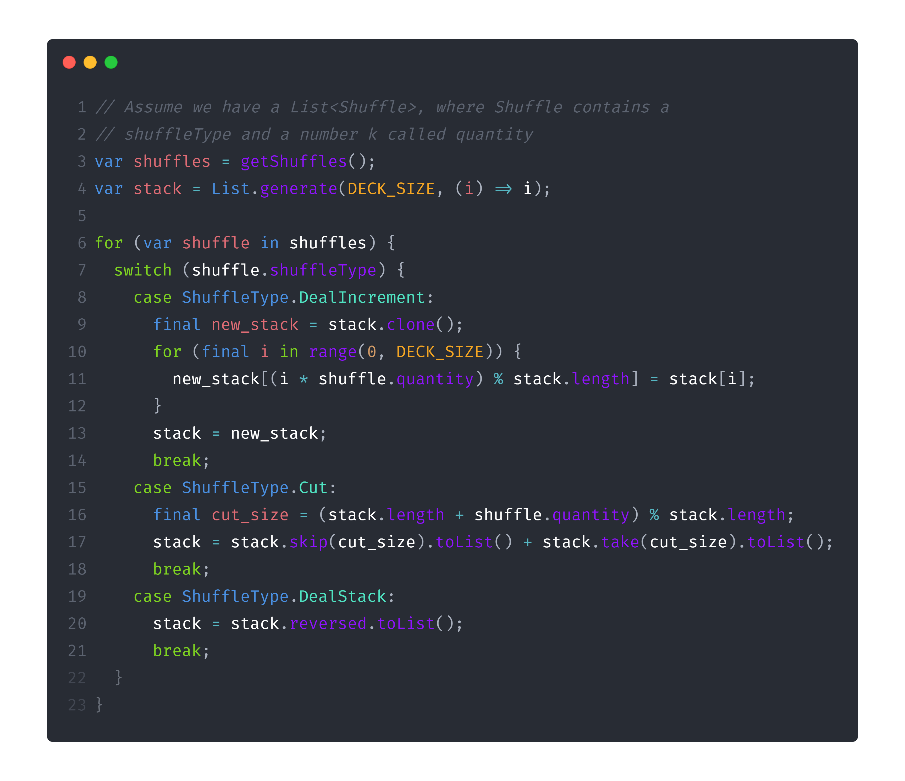

For **part two**, we are presented with a similar problem but with a HUGE amount of cards. We need to note that we can use [modular arithmetic](https://en.wikipedia.org/wiki/Modular_arithmetic) for everything, finding a way to represent modular division, which can be computed with [modular multiplicative inverse](https://en.wikipedia.org/wiki/Modular_multiplicative_inverse). We also need to compute a huge polynomial exponential. I won't explain the math behind this (I really don't know everything of it exactly, actually) but the code can be found on my [repository](https://github.com/rafaeelaudibert/AdventOfCode.dart). Something interesting is that we need to use the Dart builtin `BigInt` type which has some pretty interesting methods (such as `BigInt.modInverse` already builtin).

### Day Twenty-Four 🐛

[**Planet of Fiscord**](https://adventofcode.com/2019/day/22) uses some pretty nice helper functions with Dart functional-like methods.

- **stringify**: Given a `List<List<String>>` we want a continuous string, we can easily achieve so using `map` to join all the inner lists into strings, and join all the newly generated ones as well.

- **biodiversity_rating**: Given a `String`, we want to compute the sum of the powers of the string positions which contain a $$#$$ character. This is a job for `fold` (again)!

- **count_bugs**: Given a `List<String>` we want to know how many $$#$$ characters there are in all the strings altogether. This is a job for `fold` (again, again)!

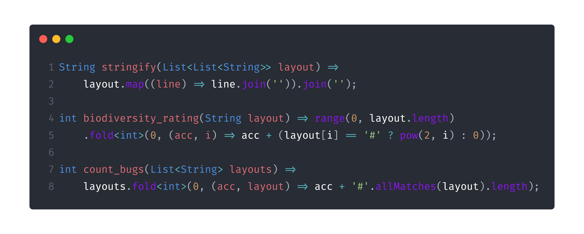

## Additional Methods ➕

I just want to finish talking about some other functional methods we have in Dart `Iterable` class which I didn't had the oportunity to use:

- **any**: Runs a function `bool Function(T element)`, for every element of the `Iterable`. If the functions returns `true` for any of the elements of it, it returns `true`, else it returns `false`. Could be replaced by a `fold(false, (acc, value) => acc || condition(value)`.

- **every**: Runs a function `bool Function(T element)`, for every element of the `Iterable`. If the functions returns `false` for any of the elements of it, it returns `false`, else it returns `true`. Could be replaced by a `fold(true, (acc, value) => acc && condition(value)`.

- **followedBy**: Receives another `Iterable<T>` and lazily concatenates them. By lazily, I mean that it won't create a new list with both `Iterable`s. This is especially useful if you will use something like a `take` or `skip` later. Imagine that you have an `Iterable` of size $$1000$$ and one of size $$100000$$ and you want a new one, with all of the first ones, and just $$1000$$ from the second. If we had something like `(firstIterable + secondIterable).take(2000)` we would actually build a `List` with size $$101000$$, but with `firstIterable.followedBy(secondIterable).take(2000)` besides being really cleaner and semantic, we didn't even generated any of the $$2000$$ numbers, occupying almost no memory in the operation.

- **skipWhile** and **takeWhile**: Similar to the already spoken `skip` and `take`, but instead of receiving an `int` as parameter, they receive a `bool Function(T element)` which must return `false` when we should stop skipping or taking elements.

## Conclusion 🎉

Wow, such a long article (those kinda reliable methods to measure the reading time said you took 18 minutes to read this, lulz). I really hope you liked it. I know it is kinda complex, and I didn't used functional programming in all of the questions, but I think you should start slowly, just like I'm doing, trying to get every time more and more on this awesome world, praising the languages with first-order functions. It is nice to see, though, that we may have some problems in non-build-to-be-used-as-functional languages, because we can have problems like the ones I warned on Day 16.

Thank you so much for taking the time to read this with me. Keep an eye on the blog for more Dart, more functional programming, and more AOC. Cya!