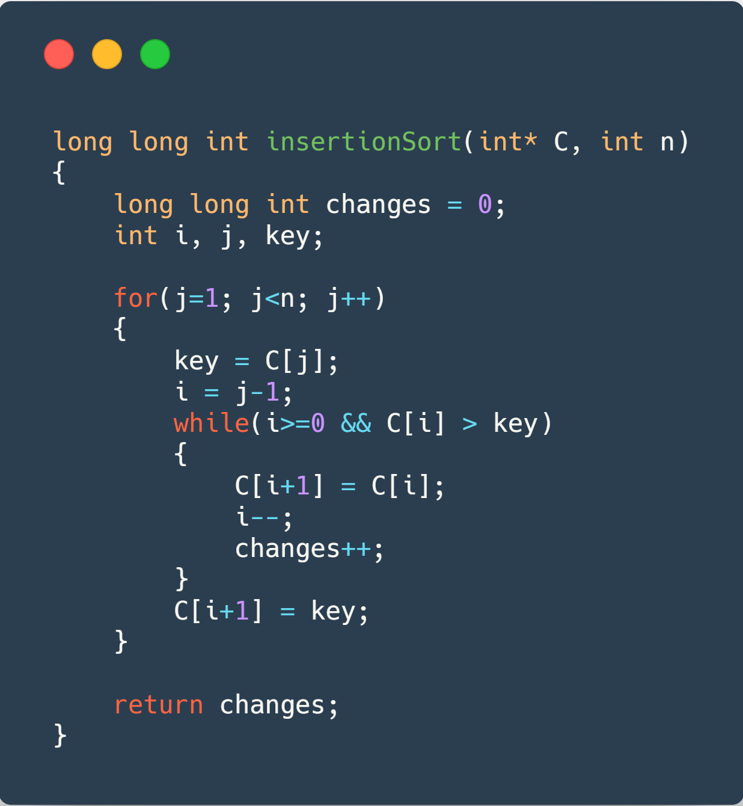

import LatexFormula from "../../../components/LatexFormula.astro"
import { 
  LinearComplexityChart,
  SquareComplexityChart,
  LogComplexityChart,
  CubicComplexityChart,
  ConstantComplexityChart,
  LinearLogComplexityChart,

  BubbleSortCharts,
  InsertionSortCharts,
  BinaryInsertionSortCharts,
  ShellSortCharts,

  ArrayTimesCharts,
} from "./charts"
import SortingTable from "./sortingTable"
import ThemeSetLight from '../../../components/ThemeSetLight.astro'

    > *Warning*: This is a legacy article, therefore it won't work well on dark mode. I suggest you turn light mode on to read this article. <ThemeSetLight/>

This is the first article, in a series of 3, on which we will talk about Sorting Algorithms with tons of charts. On this first one, we will also make an exploration about asymptotic complexity in general. We will also have a playground at the end of the article, running with `async` JavaScript code, which will be emulated live on this page, through an API connected to a backend server. You will be able to experiment some stuff (check it later).

> The JavaScript code will run in an AWS server, which will be requested through an API call. The graphics data were generated with a code written in C, compiled with GCC version $$5.1.0$$ which can be downloaded in [this](/assets/zip/sorting-1.zip) zip file containing the CSV data used as input.

## Analyzing complexity time cases ⏱️

First, we must analyze and understand the $$\Theta$$ (read theta) asymptotic notation of some simple functions. To do so, we must find a given value $$n$$, which when applied to another function of the same complexity, will make the former to be between then, that is, we have a function with a higher asymptotic value and another with a lower one. We will have some charts to help us understand what is going on (I won't say it won't have math in some of them). Remember to zoom in (maybe it will look a bit clunky, but you can do it) to see more details, especially in those where we can barely see a difference between the lines.

<ul>
  <li>
    $50n$
    

      This one can easily be seen in the chart below. We used 40 and 60 as an upper and a lower constant,
      but we could use anything just a bit higher or lower than 50 to show that this function has a complexity of $\Theta(n)$.
      As you can see this complexity is noticeable since the origin, making our value $n$, which is the lower threshold for
      the $\Theta$ notation, to be 0.  
      <LinearComplexityChart client:only="react" />
    

  </li>

  <li>
    $n^2 + 2n + 10$
    

      This one can also easily be proven to have a complexity of $\Theta(n^2)$.
      If you could zoom in closer to $x = 0$ (you will eventually, but I'm not paying MUI Pro yet),
      you would see how $n^2 + 2n + 10$ curve is higher than $2n^2$, but the later overcomes it really soon,
      between $x=4$ and $x=5$.
      
      As you can see, the purple curve (the one which is interesting for us) is just a little bit higher than the blue one,
      but it will be higher than it forever, increasing its margin little by little, making our complexity, as stated before, $\Theta(n^2)$.  
      <SquareComplexityChart client:only="react" />
    

  </li>

  <li>
    $n + \log n$
    

      This is a easy one. Just looking to the chart we can see it has a $\Theta(n)$ complexity,
      because $n \gg \log (n)$, so we can treat $\log (n)$ as a constant.  
      <LogComplexityChart client:only="react" />
    

  </li>

  <li>
    $n^3 - 100n^2$
    

      That's a tricky one, because as you can see the purple curve goes below the yellow one (it even goes negative!) for a long time,
      intersecting it only at $x=200$
      (you can verify it by calculating <LatexFormula formula="n^3-100n^2 = {n^3 \over 2} = 200" />),
      but as $n^3 \gg n^2$, we have a time complexity of $\Theta(n^3)$.  
      <CubicComplexityChart client:only="react" />
    

  </li>

  <li>
    <LatexFormula formula="2n^2 \over 3n^2-1" />
    

      Maybe you can not see the complexity of this formula right in time (I didn't), but we can prove it with what we learned in our Calculus classes, as soon as we realize that a limit solves it with mastery, as <LatexFormula formula="\lim_{x\to\infty} {2n^2 \over 3n^2-1} = {2 \over 3}" />. In conclusion, our time complexity is constant, this is $\Theta(1)$.  
      <ConstantComplexityChart client:only="react" />
    

  </li>

  <li>
    $10n \log (2n)$
    

      We need to go further with this chart to see something. Trying to see that it has a time complexity of $\Theta(n \log n)$ is a bit hard with a chart, as $\log n$ is REALLY slow, but with a chart going until $50000$ we are able to see something. With math, we can see that the purple line overcomes the blue one at $x=1024$, but we are unable to see any difference in the chart until something around $x=20000$.  
      <LinearLogComplexityChart client:only="react" />
    

  </li>
</ul>

## Analyzing Sorting Algorithms 🔃

In this first article, we will analyze the basic sorting algorithms: Bubble Sort, Insertion Sort (with its variant) and Shell Sort (with different 'sequences'). All the analysis will be made sorting arrays of unsigned integers, using two languages: C (which will have a better performance, in most cases - although not in all cases) - the chart language - and JavaScript - the playground language. We will analyze the time spent to sort the array, as well as the changes/swaps needed to do it. For Sorted and Reversed arrays, the benchmark was run only once, but to generate the Random data, each data sample was run $$12$$ times or $$2$$ minutes, whichever took less time, so that we were able to make something like an average, to avoid samples where we got a more or less ordered random arrangement of values in the array.

Another point about the random array generation is that its allocation + filling-the-array-with-values time was taken in consideration in the time measure (for sake of comparison it doesn't matter as every sample has that extra "linear" time).

> **Disclaimer:** Some weird values can be seen in the sorted array examples, partially because we just ran it once, and it could have been blocked by some OS interruption, taking longer than it would be expected, looking for us as a strange and unexpected curve in the chart.

 

### Bubble Sort 🔁

With a time complexity of $$\Theta(n^2)$$, this algorithm is probably one of the worsts algorithms to sort something (we can find something worst, like [BogoSort](https://en.wikipedia.org/wiki/Bogosort) or [SleepSort 💤](https://pt.wikipedia.org/wiki/Sleep_sort) (in Portuguese because it doesn't exist in the English Wikipedia somehow?), as it takes a LOT of time to organize an array of values, as it compares adjacent pairs of numbers to see if they are in relative order.

It was used arrays varying from $$2^1$$ until $$2^{18}$$ to generate the data below. The left y-axis shows the changes and the right one shows the time. As a reminder, the sorted charts may be a bit wrong in the time dataset, as explained before in this report (TLDR: OS interruptions can cause this).

The code used for it can be seen below, followed by the charts showing the data.

<BubbleSortCharts client:only="react" />

 
 

Some information we can retrieve from these charts is that BubbleSort has best case complexity of $$\Theta(n)$$ as it will only run through the array once, and stop, this is why it only makes $$0$$ changes and has such a small running time (0?).
Reversed case really shows us why he has such an asymptotic curve, going from $$0.82s$$ in the size $$16384$$ to incredible $$177s$$ with a size of $$262144$$ ($$16$$x bigger size, $$256$$x bigger time, as we would expect with a $$\Theta(n^2)$$ complexity). To have some fun, you can try to switch the y-axis scale back and forth between linear and logarithmic scale, to see some difference (the y-axis may be a bit glitched, showing numbers in scientific notation, couldn't figure it out how to make it looks better 🤔).

 
 

### Insertion Sort ⤵️

Let's move on to another simple sorting algorithm which we all learned in our 1$$^{st}$$ year at CS course. It also has a time complexity of $$\Theta(n^2)$$, but we will be able to see some evolution, comparing to Bubble Sort.

For these charts, we also used arrays varying from $$2^1$$ until $$2^{18}$$ to generate the data below. All blah-blah-blahs spoken about the BubbleSort are also valid here.

The code used for it can be seen below, followed by the charts showing the data.

<InsertionSortCharts client:only="react" />

 
 

I really like the Selection Sort idea, it's really a pity that it's $$\Theta(n^2)$$ worst-case complexity 😞. The reversed chart shows us that it makes exactly the same changes as BubbleSort in reverse order, although it took less time, so point to Insertion ✨. In random data, it also runs A LOT faster than Bubble sort (in this sample case, almost 3X faster). So, although both have an average-case time complexity of $$\Theta(n^2)$$, it will only be the same asymptotically, as in "small" samples Insertion can be really faster.

 
 

### Binary Insertion Sort ⤵️

Now we will have a kind of evolution of the Insertion Sort Algorithm. As we are searching the place to insert our new number, in an already ordered array, it is pretty easy to think about a binary search (maybe one day I could try to implement it with a ternary search - really don't know if it would be faster) to find the exact place where we should insert our number. So, let's see how the thing goes.

Again, arrays size varying from $$2^1$$ until $$2^{18}$$ to generate the data below. I could have used a bigger data sample, because as you will see, this is a bit faster than the last two, but to keep the comparison between them, we used the same data sample.

The code used for it, as well as the code used in the binary search, can be seen below, followed by the charts showing the data.

<BinaryInsertionSortCharts client:only="react" />

 
 

As you can see, the changes occur the exactly same times both in Normal and Binary Insertion. The great advantage comes when we don't need to compare as many times as we would compare in a normal Insertion Sort, because we can find the place we must insert ourselves in $$\log n$$ time, saving us something around 30% of time, although having an average-case time complexity of $$\Theta(n^2)$$, exactly the same as Bubble and Insertion Sort.

 
 

### Shell Sort ⤵️

Let's start talking about the Shell, thinking about the Insertion. What is it really good about? Sorting ALMOST sorted stuff! And that's what the Shell sort abuses of, making the array each time more "sorted", making it faster to get fully sorted.

It uses something called `sequences` to order different pieces of the array at the same time (you can see "all" of them [here](https://en.wikipedia.org/wiki/Shellsort) (at least, the more famous ones)). Here we used three different sequences, as follow:

- Shell Sequence _(1, 2, 4, 8, 16, 32, ...)_
- Knuth Sequence _(1, 4, 13, 40, 121, 364, ...)_
- Tokuda Sequence _(1, 4, 9, 20, 46, 103, ...)_

It is expected that each sequence makes the ShellSort faster (although, as we will see, the last two have just a small difference, not exactly one being better than the other), as they tend to decrease their time-complexity, with the Tokuda Sequence having a time-complexity not yet calculated, but probably better than the Knuth one ( <LatexFormula formula="O(N^{1+\sqrt{ {8 \ln{(5/2)}} \over {\ln{(N)}} }})" /> - too hard I know).

This time, arrays size will vary from $$2^1$$ until $$2^{28}$$ to generate the data below, to all the sequences.

The code used for it can be seen below, followed by the NINE charts (three for each sequence), showing the data. The gap sequence generation will be omitted for sake of brevity.

<ShellSortCharts client:only="react" />
  
 
 

Wow, we have a lot of data here! As you can see, ShellSort is pretty BAD at sorting already sorted arrays in comparison to the others sorting algorithms (you can see a comparison in the charts below). That would be easily solved by adding a check to see if it is already sorted (although, it wouldn't solve "almost sorted" arrays long running time). A HUGE improvement can be observed in the last two, as they only take roughly 0.1s to sort the same thing Insertion took 43 seconds!!!!11!.

Weirdly enough, Knuth's and Tokuda's sequences got pretty close not exactly saying which one is better, which is plausible, as Tokuda one doesn't have a time-complexity well-established. Anyway, we will have some comparisons to see that difference better in some charts below.

 
 

### Conclusion &amp; More Charts 👍

This is over for today! Hope you enjoyed the article, and that it gave you some insights other ones didn't give you, as it took a lot of code and time from me. Wait for similar stuff for the other sorting algorithms! Take a look in the charts below, with some direct comparisons between the different sorting algorithms, remembering that the three $$\Theta(n^2)$$ algorithms only have data until size $$2^{18}$$, while the three Shell ones go up until $$2^{28}$$.

<ArrayTimesCharts client:only="react" />

 
 
 

## Playground ⏳

These algorithms were also "translated" to JavaScript which can be accessed through the table below. The table makes API calls, hosted with the [AWS API Gateway](https://aws.amazon.com/api-gateway/) which uses an [AWS Lambda](https://aws.amazon.com/lambda/) Node.JS runtime to make the calculations (I will make a future post talking about how to configure these stuff), so we can make non-blocking requests. So that I wouldn't be surprised with a big bill on my credit card at the end of the month, the requests to the API are limited to last at most 3 seconds, so you probably won't be able to order 50000 numbers with BubbleSort. As we don't have that much computation power on an AWS machine, the times here will be really slower than the C ones which we used to make the graphics above, but if you run the same code in your machine, you would see that asynchronous Javascript makes the sorting algorithms REALLY faster when using Bubble or Insertion sort, although it makes Shell algorithm slower (we can't process a lot of things at the same time, as we must make all the different sequence values of $h$ in strict order). Hope you enjoyed, and see you next time!

<SortingTable client:load />

 
 

> This article was first written as a report for the Data Search & Classification 📊 Subject at the CS Bsc. course at [UFRGS](http://ufrgs.br), and adapted to this blog post. You can find the original post with the API running on a Node.JS backend (some order of magnitude faster than this one up here) on [this repo](https://github.com/rafaeelaudibert/LaboratoriosCPD.js/tree/nodeJS) on my Github.
