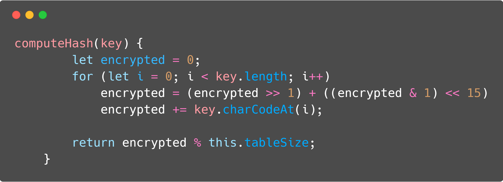
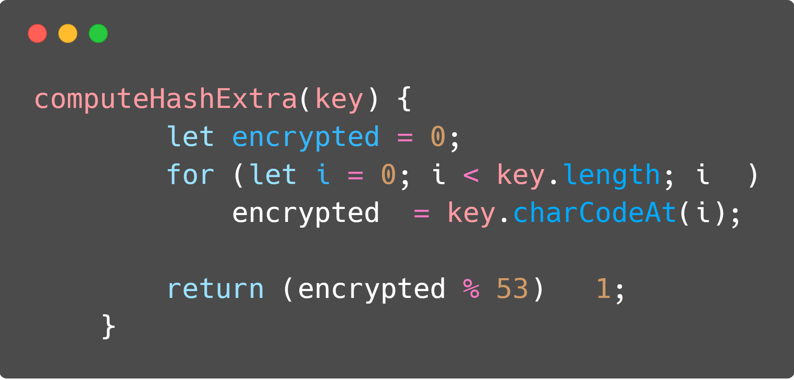
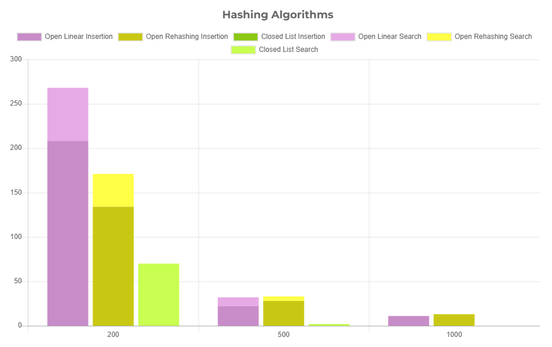

import HashTable from './hashTable.tsx'
import ThemeSetLight from '../../../components/ThemeSetLight.astro'

    > *Warning*: This is a legacy article, therefore it won't work well on dark mode. I suggest you turn light mode on to read this article. <ThemeSetLight/>

This is the third and last article on which we will talk about Sorting Algorithms with tons of charts. In this one, we will actually not speak about a sorting algorithm, I am sorry, but about hashing algorithms which will make us able to build a Hash Table (think about a `dictionary` on Python). This kind of algorithms allows us to retrieve some data with an alphanumeric key, instead of a numeric key, as we would do with an array. You will be able to experiment it in the bottom of the page, adding information to the hash, and seeing if it is available or not with an incredible $$\Theta(1)$$ time complexity.

> This time, the JavaScript code will run in your own browser, as the Hash Table is size-limited to 1009 slots, so it won't eat all of your memory.

 

## Introduction 🔃

Hash is an incredible tool to access information through an alphanumeric key (can be extended to more types of keys, but only alphanumerics ones will be covered in this report). It is natively implemented in most of the high-level languages (`dictionaries` in Python, `normal objects` in JavaScript) and even some implementation in kinda low-level languages (such as the `map` data structure in C++ - if you consider C++ a low-level language). Which is pretty awesome is that it has an $$\Theta(1)$$ time complexity, which means that no matter how many data are in the Hash Table, we can access any value with a constant time.

 

## Hashing functions 🔃

In the texts/codes below, when we talk about hashing functions we are talking about the function which we pass a string and it returns us a key which will be used to access the hash table. For this code, we used 2 different hashing functions, as can be seen in the code below. The first one is the primary one, while the second one is used with the rehashing algorithm, which will be explained below.

 

### Analyzing hashing algorithms 🔃

Three types of hashing algorithms will be used, divided into two categories: Open and Closed Hashing. Talking about Open Hashing we will have the Linear Search algorithm, which tries to verify the next position of the Hash Table if the actual is already filled, and the Rehashing Algorithm, which has an increment calculated through another hashing function, trying to minimize the conflicts. The closed hashing algorithm used is the Listing Algorithm, which creates a list in each of the possible hashed key values instead of trying to find another place to insert it. In the chart below we can see the comparison between the three. They were tested against this names database when inserting, and this names when searching, varying the table size, and the data showed is the quantity of collision in the insertion.

{/* This used to be a chart but I couldn't make it work using MUI X Charts, so it's a static image now */}

  

## Playground ⏳

This time we only made JavaScript code, as it would be kinda hard to deal with strings in C. You can test the rehashing algorithm below. Make some exploration and discover what you can do with it. By default, the table has roughly 1000 spaces, so don't insert too much 'cause it may crash as I didn't totally handle when the HashTable is full to be able to resize it. Hope you enjoyed it again, and see you next post!

<HashTable client:only="react" />
 

> This article was first written as a report for the Data Search & Classification 📊 Subject at the CS Bsc. course at [UFRGS](http://ufrgs.br), and adapted to this blog post. You can find the original post with the API running on a Node.JS backend (some order of magnitudes faster than this one up here) on [this repository tag](https://github.com/rafaeelaudibert/LaboratoriosCPD.js/tree/nodeJS) on my Github.