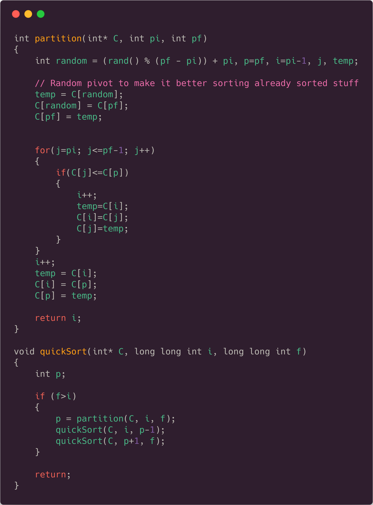
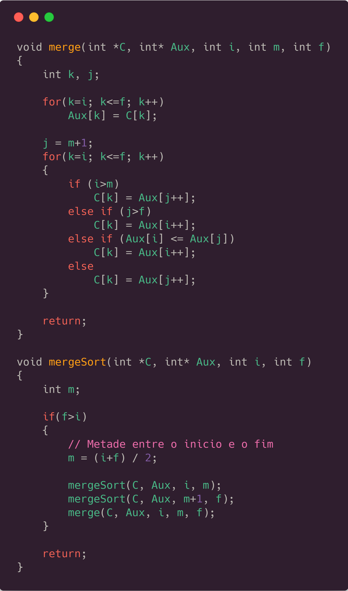
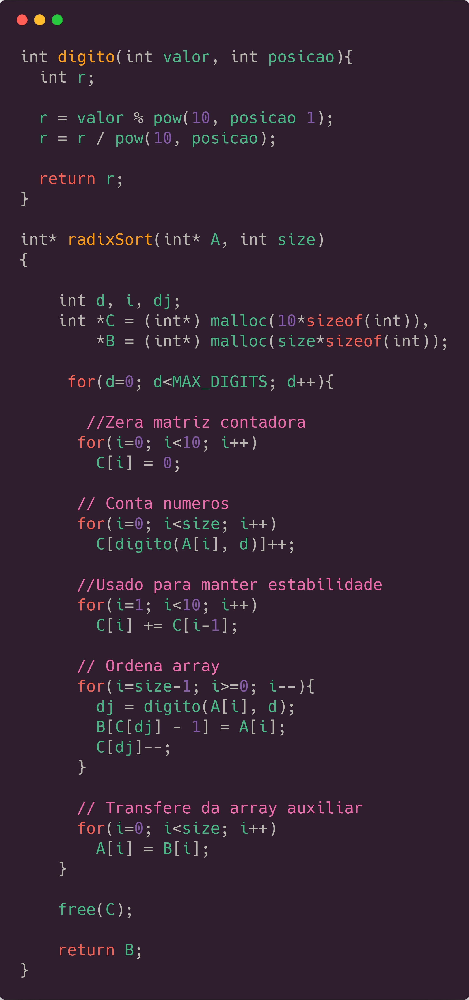
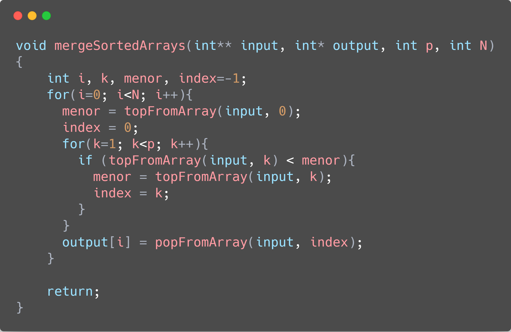
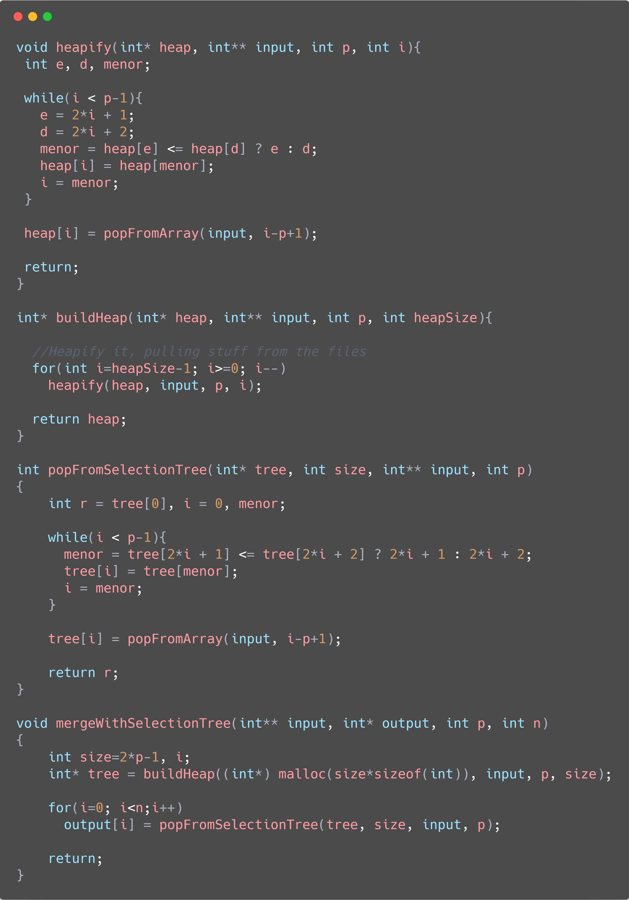

import { QuickSortCharts, MergeSortCharts, RadixSortCharts, RecursiveSortingCharts, FileSortingCharts } from './charts.tsx'
import SortingTable from './sortingTable.tsx'
import ThemeSetLight from '../../../components/ThemeSetLight.astro'

    > *Warning*: This is a legacy article, therefore it won't work well on dark mode. I suggest you turn light mode on to read this article. <ThemeSetLight/>

This is the second article, in a series of 3, on which we will talk about Sorting Algorithms with tons of charts. On this first one, we will see intermediate sorting algorithms with better time complexity. We will also have a playground at the end of the article,  with `async` JavaScript code running with a remote API, similar to the one you saw in the first article (but better).

> The JavaScript code will run in an AWS server, which will be requested through an API call. The graphics data were generated with a code written in C, compiled with GCC version $$5.1.0$$ which can be downloaded in [this](/assets/zip/sorting-2.zip) zip file containing the CSV data used as input.

## Introduction 🔃

In the first article, we analyzed some basic sorting algorithms: Bubble Sort, Insertion Sort, and Shell Sort. In this one, we will analyze some better options with a $$\Theta(n\log(n))$$ time complexity, which are named QuickSort and MergeSort. We will also have some fun with a $$\Theta(n)$$ algorithm called RadixSort, which works only for numbers (it is pretty good, though). We will also have some special data structure demonstration to do something like a "merge" between files, containing ordered data. It will take all the data on the $$n$$ files, and make it ordered in a brand new file. We will make it following three different strategies: Quick Sort (same as in the first part), Merge Arrays (similar to the MergeSort seen before) and using Selection Trees (which uses a kind of HeapSort).

 

## Analyzing Sorting Algorithms - Pt. 1 🔃

Talking about the first part of the article, in the folder with all the data, you can find sorting tests with different quantity of files, which can be read as <i>&lt;sortingAlgorithm&gt;&lt;quantityOfFiles&gt;.csv</i>. The data below will refer to the data when tested against 200 files because it will make a better average time/recursion calls taken to go through the algorithm, as well as a better time/recursion calls standard deviation.

 

### Quick Sort 🔁

QuickSort is probably the most known and used sorting algorithm. It is used (with some variations) in most of the built-in sort algorithms of programming languages. It has a worst case time complexity of $$\Theta(n^2)$$, but it occurs so rarely (if implemented the right way), that its average case time complexity is the so long searched $$\Theta(n\log(n))$$.

It was used arrays varying from $$2^1$$ until $$2^{19}$$ (random generated numbers) to generate the data below, as we couldn't use larger arrays cause of recursion depth limit. The left y-axis shows the total recursive calls and the right one shows the time. As a reminder, the sorted charts may be a bit wrong in the time dataset, as explained in the latter article (TLDR: OS interruptions can cause this).

The code used for it can be seen below, followed by the chart showing the data (in the test with the 200 files, as said before).

<QuickSortCharts client:only="react" />

 

We also have more data about it, which you can find in the CSV files, linked above. Quicksort has a standard deviation of 0.01s when talking about the time taken to make it, as well as a standard deviation of roughly 300 recursive calls, which is not that much, actually. If we compare Quick Sort, with the algorithms seen in the other article, we can see a HUGE difference (you can see that difference in the Playground below).

 

### Merge Sort ⤵️

Let's move on to another sorting algorithm which almost everybody knows. It also has an average time complexity of $$\Theta(n\log(n))$$, having it as its worst-case time complexity as well.

The code used for it can be seen below, followed by the charts showing the data.

<MergeSortCharts client:only="react" />

 

What is really nice about MergeSort is that it makes the exact same amount of recursive calls every time, doesn't matter how the array is ordered, so we have 0 as its standard deviation for recursive calls, and an average
standard deviation of 0.01s, similar to QuickSort. That happens because it ALWAYS split the array exactly in the middle, what didn't happen with QuickSort, which could make the recursion tree pretty unbalanced. Below you will be able to see that Merge Sort is actually a bit slower than QuickSort, and that's why we don't see it implemented as the standard sorting algorithm in a lot of programming languages. A factor that causes it to take more time, is that it has a lot more recursive calls comparing to QuickSort (1048575 vs 702256, when tested against 524288 numbers). Something really nice is that we can see how MergeSort creates a perfect tree looking to the number of recursive calls. It will always represent $$n * 2 - 1$$, with $$n = $$ _quantity of numbers to be sorted_.

 

### Radix Sort 🔁

RadixSort should be, in theory, an incredibly fast algorithm to sort numbers. It has a $$\Theta(n)$$ time complexity and doesn't make a single comparison to sort the numbers, although it uses some auxiliary memory.

Its basic idea is that it uses $$10$$ stacks, to put each number in a different one according to a specific digit of it (that's why it only works for specific kinds of data, like integers and strings). If you order the numbers going from the least significant digit to the most significant one, using a stack to maintain its stability, you have a really fast algorithm, which can be seen below, as well as a chart to see some information about it:

<RadixSortCharts client:only="react" />

 

It's kinda interesting because RadixSort doesn't look THAT fast if we compare with the others which we tried before (we have a chart below). It is really nice, because it actually has no recursion, being purely iterative, and doesn't make a single comparison, just a huge numerical manipulation, which is really impressive. That algorithm is called LSD Radix Sort (LSD stands for least-significant-digit) because we order according to the least significant digit before. If we would sort it with an MSD RadixSort, we would need to change our code, and add some comparisons, because just ordering from the most to the least significant digit, wouldn't sort the numbers accordingly. RadixSort has a 0.02 seconds standard deviation, which is pretty low, similar to the others. The standard deviation of recursive calls is 0, as it doesn't make any recursion or comparison at all.

 

### Conclusion - Pt. 1

Here we will put all the last 3 algorithms together, to see a comparison between the time they take to sort the different arrays sizes. It will also be used the dataset referring to the 200 files input, as it has a better probabilistic chance of representing the real average time for their execution.

<RecursiveSortingCharts client:only="react" />

 

As said before, it is weird that RadixSort is slower than the others, which I assume is something related to the function who takes the digit from the number, as it has some potentiation and modulo arithmetic, which take a lot of computation. Something crazy we can see when testing with the Playground below, is that Javascript is some order of magnitudes slower than C to make a QuickSort sorting.

 

## Analyzing sorting algorithms - Pt. 2 🔃

This second part was divided trying three different "data structures".

We have $$n$$ different files with numbered data inside of it. The point is that each file has its data ordered, and our mission is to create a huge new file containing all the data in those files, ordered as well.

In this part, we have a problem. As our final array can be HUGE according to the size of the input arrays, and the number of input files which will be merged, some types of data structures only have data until $$2^{14}$$ for some quantity of files, while the most of it will have data until $$2^{19}$$

The first one, which will be referred as "Files Quick Sort", is a kind of application of Quick Sort Algorithm. It is the one with problems with huge arrays because it will reach maximum recursion depth really fast. It will be the slower of the three structures, as the fact of the data inside of the files being already ordered doesn't make any difference, because it will try to sort it anyway.

The second one will be called "Merge Arrays", and is somewhat similar to a Merge Sort algorithm, but taking in consideration that we already separated and merge most of the arrays, making the algorithm just the merge part of the MergeSort full algorithm, or, if you prefer, just the part where you are "coming back" from the recursion.

The third implementation, called "Selection Tree", uses a _Minimum Heap_ to sort all the data in the files. A _Heap_ is a special type of data tree stored in the format of an array. We will have the top of our files in the "leaves" of the heap, and the smallest number in all the files in the root of the tree. Each step, we remove the smallest one, inserting it in the final sorted array, and moving the smallest number back to the root of the heap.

All the implementations can be seen in the codes below (QuickSort will be omitted, as it has already been shown before), as well as a chart comparing the three different structures.

<FileSortingCharts client:only="react" />

 

It's interesting, because QuickSort gets the prize for faster, although I wasn't waiting for it, as the others are REALLY fast. The problem is that, as we go to bigger array sizes, Quick Sort just COMPLETELY crashes (in the chart above, it couldn't sort 6.5 million numbers). I think this happens because, as we are testing with 200 files, our final array size will be kinda big, so the recursion will be HUGE to handle all this sorting. Maybe I implemented something wrong, but I don't think that is the case, because it starts to crash just when testing against TONS of files, with huge array sizes in it. Another interesting thing is that the merging technique has almost the same average time taken as the heap sort/selection tree one, and god, they are REALLY fast, because as you can see they take smth around 0.62s to sort incredible 104 MILLION numbers (okay, the numbers are partially ordered and the algorithms abuse of this, but it is something really awesome anyway).

  

## Playground ⏳

These algorithms were also "translated" to JavaScript which can be accessed through the table below. The table makes API calls, hosted with the [AWS API Gateway](https://aws.amazon.com/api-gateway/) which uses an [AWS Lambda](https://aws.amazon.com/lambda/) Node.JS runtime to make the calculations, so that we can make non-blocking requests. So that I wouldn't be surprised with a big bill on my credit card at the end of the month, the requests to the API are limited to last at most 3 seconds, so you probably won't be able to order 50000 numbers with BubbleSort. As we don't have that much computation power on an AWS machine, the times here will be really slower than the C ones which we used to make the graphics above, but if you run the same code in your machine, you would see that asynchronous Javascript makes some sorting algorithms REALLY fast (you can see the explanation in the latter article). Hope you enjoyed, and see you next time!

<SortingTable extended client:load />

 

> This article was first written as a report for the Data Search & Classification 📊 Subject at the CS Bsc. course at [UFRGS](http://ufrgs.br), and adapted to this blog post. You can find the original post with the API running on a Node.JS backend (some order of magnitudes faster than this one up here) on [this repository tag](https://github.com/rafaeelaudibert/LaboratoriosCPD.js/tree/nodeJS) on my Github.